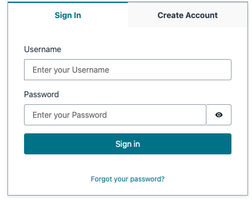

# Nuxt3 + AWS Amplify

This is a sample project to show how to integrate [Nuxt3](https://nuxt.com/) with [AWS Amplify](https://ui.docs.amplify.aws/vue/getting-started/installation).

Nuxt v3 has been released officially on 2022-11-16. You can read the [release note](https://nuxt.com/v3) for more details.

## What is AWS Amplify.js?

The Amplify Framework is a comprehensive set of tools and services that can be used together or on their own, to help front-end web and mobile developers build scalable full stack applications. I really recommend you to read the [official documentation](https://docs.amplify.aws/) to learn more about it.

## What is Nuxt.js?

The Intuitive Vue Framework. Nuxt.js is a free and open source web application framework based on Vue.js, Node.js, Webpack and Babel.js. I really recommend you to read the [official documentation](https://nuxtjs.org/) to learn more about it.

## Getting Started

Update your aws config file `plugins/amplify.ts` with your own credentials.

```ts
const awsConfig = {
  Auth: {
    region: 'ap-southeast-1',
    userPoolId: 'ap-southeast-x_XXXXXX',
    userPoolWebClientId: 'xxxxxxxxxxxxxxxxxxxxxxxxxx',
    identityPoolId: 'ap-southeast-1:x-xxxxxxx-xxxx-xxxx-xxxx-xxxxxxxxxxxx'
  }
};
```

## Build Setup

```bash
# install dependencies
$ yarn install
```

```bash
# serve with hot reload at localhost:3000
$ yarn dev
```

